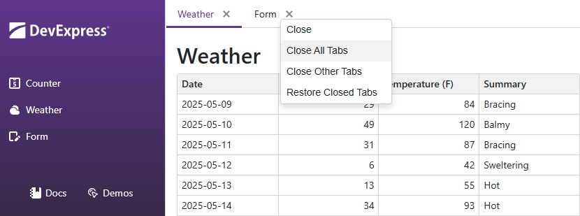

<!-- default badges list -->

[](https://supportcenter.devexpress.com/ticket/details/T1288385)
[](https://docs.devexpress.com/GeneralInformation/403183)
[](#does-this-example-address-your-development-requirementsobjectives)
<!-- default badges end -->
# Blazor Tabs - Create a Dynamic Tabbed Interface

The example demonstrates how to create an interactive multi-tab web interface with DevExpress Blazor [Tabs](https://docs.devexpress.com/Blazor/405074/components/layout/tabs) and [Context Menu](https://docs.devexpress.com/Blazor/405060/components/navigation-controls/context-menu) components.



It showcases core features that help end users build their personalized workspaces and multitask effectively.

### Organize Content Into Tabs

Place [DxTabs](https://docs.devexpress.com/Blazor/DevExpress.Blazor.DxTabs) container on the page (_Components/Pages/Index.razor_) and add a [DxTabPage](https://docs.devexpress.com/Blazor/DevExpress.Blazor.DxTabPage) for each tab.

Insert your custom Blazor components or content directly into each DxTabPage.

```razor
<DxTabs @ref=tabs
        @bind-ActiveTabIndex=activeTabIndex
        AllowTabReorder="true"
        TabReordering="OnTabReordering"
        TabClosing="OnTabClosing"
        RenderMode="TabsRenderMode.AllTabs">
    <DxTabPage CssClass="counter-tab"
               AllowClose="true"
               VisibleIndex="@collection.GetVisibleIndexByTabText("Counter")"
               Visible="@collection.GetVisibleByTabText("Counter")"
               Text="Counter">
        <div class="tab-body">
            <Counter />
        </div>
    </DxTabPage>
```

The CssClass property of a tab page serves as a unique identifier, allowing client-side scripts to interact with specific tabs.

### Persist Tab State

Implement a custom **MDITab** class to encapsulate specific properties of each individual tab. **MDITabCollection** will control visibility, display order, and titles of all tabs. The title links an underlying object to the visual tab representation in the UI.

Bind these properties to the visual tab elements in the UI. To ensure the MDITabCollection accurately reflects the live interface, implement event handlers for TabReorder and TabClosing. These handlers will listen for user actions and dynamically update the collection to match the current tab state.

To maintain the tab layout across sessions, serialize the collection to JSON and save it to the browser's local storage with **MDIStateHelper** class every time the UI layout changes. It maintains the tab visibility and order even after the user closes and reopens the browser. Tab state is restored in the OnAfterRenderAsync event handler.

### Add Context Menu to Tabs

Create a context menu that allows users to manage tabs:

- Close the current tab.
- Close all tabs.
- Close all tabs except for the current one.
- Restore closed tabs.

Place [DxContextMenu](https://docs.devexpress.com/Blazor/DevExpress.Blazor.DxContextMenu) on the page (_Components/Pages/Index.razor_) and add a [DxContextMenuItem](https://docs.devexpress.com/Blazor/DevExpress.Blazor.DxContextMenuItem) for each menu action.

```razor
<DxContextMenu @ref=menu>
    <Items>
        <DxContextMenuItem Click="CloseTab" Text="Close"></DxContextMenuItem>
        <DxContextMenuItem Click="CloseAllTabs" Text="Close All Tabs"></DxContextMenuItem>
        <DxContextMenuItem Click="CloseOtherTabs" Text="Close Other Tabs"></DxContextMenuItem>
        <DxContextMenuItem Click="RestoreAllTabs" Text="Restore Closed Tabs"></DxContextMenuItem>
    </Items>
</DxContextMenu>
```

Implement a client-side script (_wwwroot/js/mdi.js_) to handle right-clicks on specific tabs, identified by their CssClass property. This script should prevent the default browser context menu. Capture the mouse position, and invoke a .NET [JSInvokable] method.

## Files to Review

- Index.razor
- NavMenu.razor
- MainLayout.razor
- MDITab.cs
- MDITabCollection.cs
- MDIStateHelper.cs
- mdi.js

## Documentation

- [DxTabs Class](https://docs.devexpress.com/Blazor/DevExpress.Blazor.DxTabs)
- [DxTabPage Class](https://docs.devexpress.com/Blazor/DevExpress.Blazor.DxTabPage)
- [DxContextMenu Class](https://docs.devexpress.com/Blazor/DevExpress.Blazor.DxContextMenu)
- [DxContextMenuItem Class](https://docs.devexpress.com/Blazor/DevExpress.Blazor.DxContextMenuItem)

## More Examples

- [Form Layout for Blazor - Tabbed Wizard](https://github.com/DevExpress-Examples/Form-Layout-for-Blazor-Tabbed-Wizard)

<!-- feedback -->
## Does this example address your development requirements/objectives?

[](https://www.devexpress.com/support/examples/survey.xml?utm_source=github&utm_campaign=MDITabs&~~~was_helpful=yes) [](https://www.devexpress.com/support/examples/survey.xml?utm_source=github&utm_campaign=MDITabs&~~~was_helpful=no)

(you will be redirected to DevExpress.com to submit your response)
<!-- feedback end -->
